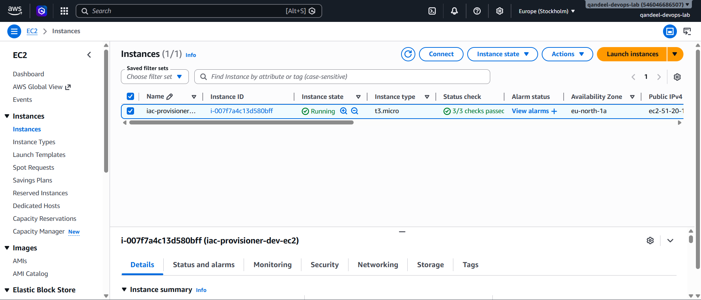
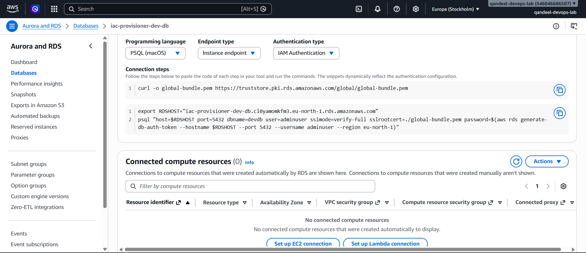
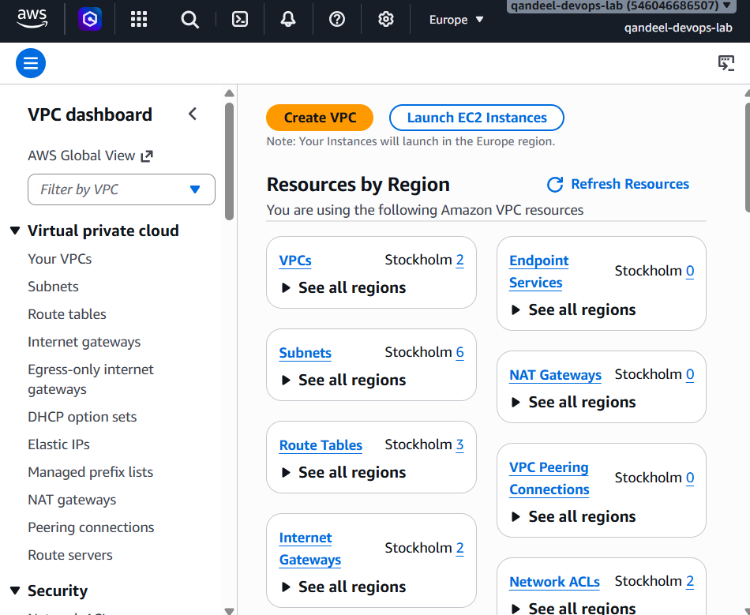
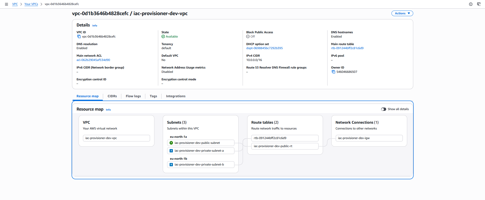

# IaC Multi-Environment Provisioner


A production-style Infrastructure as Code project that provisions dev, staging,
and production AWS environments from a single Terraform codebase using Terragrunt.
Every infrastructure change goes through a security scan before anything is applied.

---
## Key highlights

- **Zero code duplication** — dev, staging, and prod provisioned from a single
  Terraform codebase using Terragrunt
- **15 tfsec security issues identified and resolved** before any infrastructure
  was deployed to AWS
- **Security gate in CI** — no infrastructure change is applied without passing
  tfsec scan first
- **Remote state with locking** — S3 backend with DynamoDB locking prevents
  concurrent Terraform runs
- **Manual approval gate** — production apply requires explicit approval before
  any changes are made

---

## What this project demonstrates

- Writing reusable Terraform modules for VPC, EC2, and RDS
- Using Terragrunt to manage multiple environments without duplicating code
- Remote state stored in S3 with DynamoDB locking to prevent concurrent conflicts
- Security scanning with tfsec integrated as a CI gate — no infrastructure
  change is applied without passing security checks
- GitHub Actions pipeline with plan on PR and apply on merge
- 15 tfsec security issues identified and resolved before any deployment

---

## Tech stack

| Tool | Purpose |
|---|---|
| Terraform | Provisions AWS infrastructure from code |
| Terragrunt | DRY wrapper — one codebase for dev, staging, and prod |
| AWS EC2 | Virtual machine — application server |
| AWS RDS | Managed PostgreSQL database |
| AWS VPC | Networking — subnets, security groups, flow logs |
| AWS S3 | Remote state backend |
| AWS DynamoDB | State locking — prevents concurrent Terraform runs |
| GitHub Actions | CI/CD — security scan and plan on PR, apply on merge |
| tfsec | Security scanner — checks Terraform before apply |

---

## Project structure

```
iac-provisioner/
├── modules/
│   ├── vpc/          # VPC, subnets, internet gateway, flow logs
│   ├── ec2/          # EC2 instance with security group
│   └── rds/          # PostgreSQL RDS instance
├── environments/
│   ├── terragrunt.hcl        # root config — shared by all environments
│   ├── dev/
│   │   ├── terragrunt.hcl    # dev-specific values
│   │   ├── main.tf           # calls all three modules
│   │   └── variables.tf
│   ├── staging/
│   │   └── terragrunt.hcl
│   └── prod/
│       └── terragrunt.hcl
└── .github/
└── workflows/
└── terraform.yml     # CI/CD pipeline
```

---

## How it works

Modules are written once and reused across all three environments. Each environment only defines what is different — instance size, CIDR block, database name.
Terragrunt handles the shared config like remote state backend and AWS region.

The CI/CD pipeline runs on every pull request and merge:

```
PR opened
→ tfsec security scan (fail if critical issues found)
→ terraform plan (show what will change)
PR merged to main
→ terragrunt apply to dev automatically
```

---

## Security hardening applied

tfsec found 15 issues on the first scan. All were resolved before any deployment:

- SSH access restricted to my IP address only
- EC2 disk encryption enabled
- EC2 metadata service secured with HTTP token requirement
- RDS storage encryption enabled
- RDS IAM authentication enabled
- VPC flow logs added for network traffic monitoring
- Intentional exceptions documented with inline ignore comments

---

## Screenshots

### EC2 instance running in AWS (eu-north-1)


### RDS PostgreSQL database — Available with IAM authentication enabled


### VPC resource map — 3 subnets across 2 availability zones


### S3 remote state bucket — terraform.tfstate stored with versioning enabled


---

## Environment differences

| Setting | Dev | Staging | Prod |
|---|---|---|---|
| EC2 instance type | t3.micro | t3.micro | t3.small |
| VPC CIDR | 10.0.0.0/16 | 10.1.0.0/16 | 10.2.0.0/16 |
| RDS instance class | db.t3.micro | db.t3.micro | db.t3.micro |

---

## How to run

```bash
# Load AWS credentials
source ~/.devops-secrets/iac-provisioner/credentials.env

# Initialise dev environment
cd environments/dev
terragrunt init

# See what will be created
terragrunt plan

# Apply to dev
terragrunt apply

# Destroy when done — always run this after each session
terragrunt destroy
```
---

## What I learned

- How Terragrunt eliminates code duplication across environments — one module,
  three environments, zero repetition
- Why remote state with locking matters — without DynamoDB locking, concurrent
  Terraform runs can corrupt state
- How tfsec catches real security issues before deployment — encryption,
  IAM auth, metadata service hardening are easy to miss without a scanner
- How to structure reusable Terraform modules with clean inputs and outputs —
  each module independently testable
- Why a manual approval gate before production apply is critical —
  automation is great until it deletes prod
- How to build a CI pipeline that treats infrastructure changes like code —
  scan, plan, review, apply
